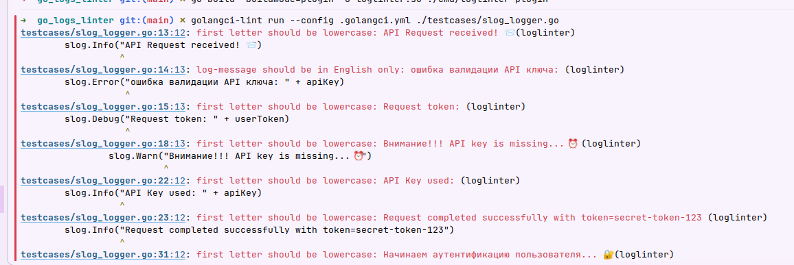

# go_logs_linter
Линтер для Go, совместимый с golangci-lint, который анализирует лог-записи в коде и проверяет их соответствие установленным правилами


# Инструкция по установке и запуску линтера:

## Использование кастомного линтера в командной строке

1) Собираем линтер:

    ```bash
    go build -o path/to/compiled/linter ./cmd/logslint 
    ```

2) Запускаем линтер для всех файлов проекта:

    ```bash
    go run path/to/compiled/linter ./...
    ```

3) Запускаем линтер для определенного пакета:

    ```bash
    go run path/to/compiled/linter ./path/to/package
    ```

## Запуск линтера с помощью golangci-lint

### Если не установлен golangci-lint, необходимо это исправить:

1) Установка golangci-lint

    ```bash
    go install github.com/golangci/golangci-lint/cmd/golangci-lint@latest
    ```

   2) Очень важно проверить, что кастомный линтер собирается с той же версией, что и golangci-lint - в противном случае исправить это (так как плагин просто не заработает)

      Как я решала проблему:

      Установка Go 1.25.7:
   
      ```bash
      wget https://go.dev/dl/go1.25.7.linux-amd64.tar.gz
      ```

      Удаление старой версии и установка новой:
   
      ```bash  
      sudo rm -rf /usr/local/go
      sudo tar -C /usr/local -xzf go1.25.7.linux-amd64.tar.gz
      ```

      Проверка версии:
   
      ```bash
      go version  # должно показать go1.25.7
      ```   

   Устанавливаем необходимую версию tools

   ```bash
   go get golang.org/x/tools@v0.31.0
   ```

   Обновление зависимостей
   
   ```bash
   go mod tidy
   ```

   Проверка измененной версии

   ```bash
   go list -m golang.org/x/tools  # Должно показать: golang.org/x/tools v0.31.0
   ```
   
### Основная инструкция

1) Билдим линтер как плагин (то есть нам нужно чтобы плагин был скомпилирован как shared object (.so) файлы)

    ```bash
    go build -buildmode=plugin -o loglinter.so ./cmd/loglinter-plugin
    ```

2) Запускаем с кастомным линтером

    ```bash
    golangci-lint run --config .golangci.yml path/to/file
    ```
   Пример запуска линтера:
   

# Полезные материалы

    - https://www.youtube.com/live/BkTJysDTlb0?si=2TbEHMcd1DfyzFYr (чтобы разобраться, как именно устроен пакет golang.org/x/tools/go/analysis, а также как подключить кастомный линтер к golangci-lint)
    - https://habr.com/ru/companies/ostrovok/articles/908768/#habracut (очень хорошая статься, чтобы разобраться, как подходить к разработке своего линтера)
    - https://youtu.be/Q9ymKAVgQ_8?si=uvCPx7LBYGehgYKB (для общего понимания, что из себя представляет golangci-lint)
    - https://habr.com/ru/articles/457970/ (более подробно о линтерах в Go, возможностях golangci-lint)
